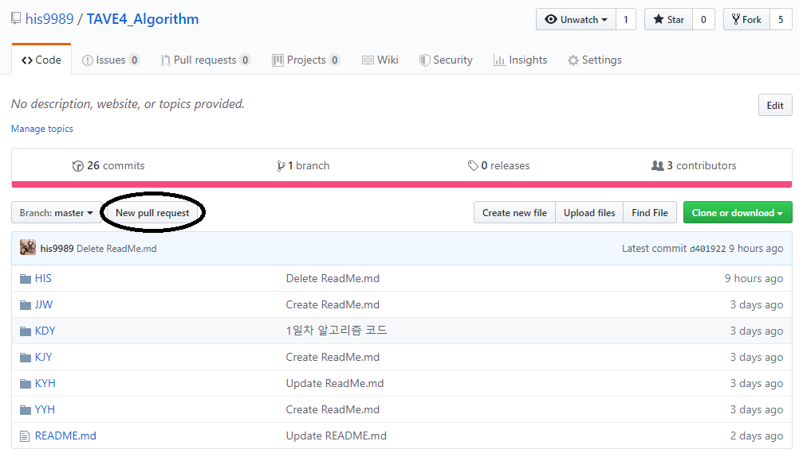
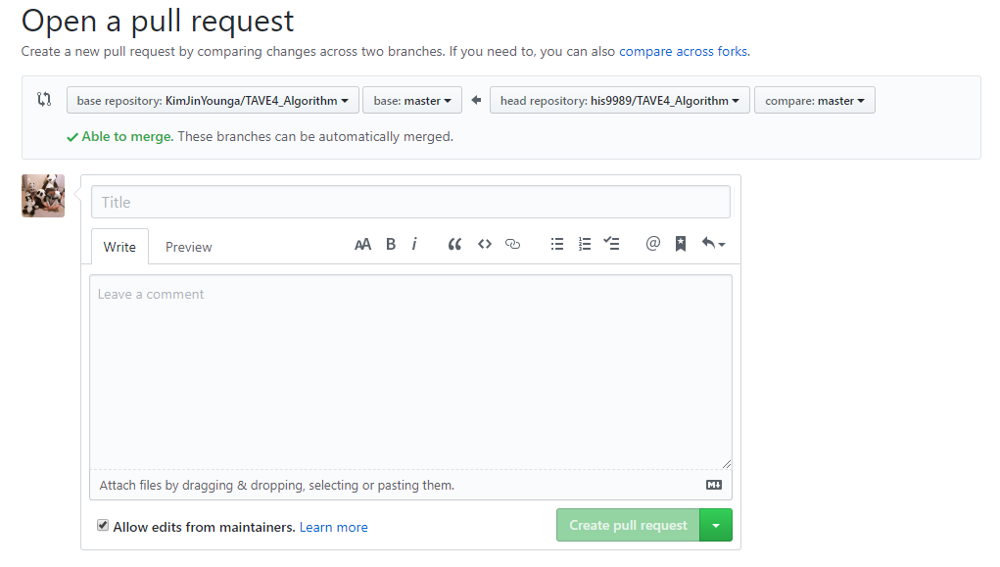

### 4차 산업혁명 동아리 T-AVE 4기 하반기 알고리즘 스터디 
### 학기 중이라 스터디 같은건 까딱하면 슬렁슬렁 대충 넘어가서 하반기는 각박하게 합니다.
### 그래도 개인 사정 인정합니다.. 도망가지마요..

---

#### Member
* 김석완(KSW), 양윤희(YYH), 정지원(JJW), 한승훈(HSH), 한인수(HIS)

---

#### Period
* 19.09.28 : 1차 스터디 (이대)
* 19.10.05 : 2차 스터디 (세종대)
* 19.10.12 ~ 19.10.26 : 시험기간 휴동
  + 자발적 지원 받아서 과제 수행하고 서로 확인하기. 
  + 가능하면 되는애들끼리 모여서 코테 or 모각코 ㄱㄱ
* 19.11.02 : 3차 스터디 (시립대)
* 19.11.09 : 4차 스터디 (동국대)
* 19.11.16 : 5차 스터디 (이대)
* 19.11.23 : 6차 스터디 + 총회 (세종대)
  + 여기까지 스터디 진행.
* 19.11.30 : 컨퍼런스 리허설
* 19.12.07 : 제 2회 컨퍼런스
  
---

#### ★ 진행 방식 : 1차 때 상황보고 조정 예정입니다. 과제 리뷰는 세미나와 합쳐집니다.
* 개인 과제 수행
  + <b> 1일 1문제 </b> 를 원칙으로 합니다. 즉, 매 주 스터디에는 5문제를 풀어와서 리뷰해야합니다.
  + 단, 학기 및 직장, 개인 사정 등에 의해 조정 가능합니다.
  + 어떤 문제를 풀지, 각자 몇 문제를 풀어올지는 직전 스터디에 선정합니다.
* 과제 소스 코드 깃헙에 업로드 및 Pull Request
  + 소스 코드는 스터디 시작 전에 업로드, Pull Request 해야합니다.
  + Github을 할 줄 모르는 경우 첫 스터디 때 가르쳐드리겠습니다.
* 과제 리뷰
  + 직전 스터디에서 문제를 결정하면, 각자 풀어올 문제를 정합니다. (5문제 중 하나씩 정하기)
  + 각자 담당한 문제에 대해 "접근 방식", "알고리즘 적용 방식", "직면한 에러와 해결방법" 등을 발표합니다.
  + 풀지 못한 경우, 인터넷에서 소스코드를 분석해서 설명해도 좋습니다.
  + 발표는 5분 분량으로 진행합니다.
* 코딩 테스트 진행
  + 코딩 테스트 문제는 직전 스터디에 회의를 통해 선정합니다.
  + 코딩 테스트에는 잡담 및 핸드폰 등을 엄금합니다.
  + 협조해주세요. 집중합시다 집중!
  + 코테의 리뷰 시간은 따로 없습니다. 
  + 코테 리뷰를 원하는 경우 코테 문제를 다음 주 과제로 진행하여 발표하는 식으로 대체하겠습니다.

|진행 시간|진행 내용|
|:---:|:---:|
|14:00 ~ 14:30|Tave 공지 및 노트북 준비 등|
|14:30 ~ 15:10|과제 리뷰 - 40분 (인당 5분)|
|15:10 ~ 15:20|쉬는 시간|
|15:20 ~ 16:20|코딩 테스트 - 60분|
|16:20 ~ 16:30|쉬는 시간|
|16:30 ~ 16:50|과제/세미나/코테 계획|
  
---

#### ★ 지금 할 일
* 스터디/프로젝트 보증금 입금.
  + 계좌 등 내용은 카카오톡 확인
  + 기한은 수요일(9/25)까지
* Github 계정 만들어서 아이디를 한인수에게 알려주고 본 레파지토리 Fork하기
  + 할 줄 모르는 분들은 첫 스터디 때 알려드리겠습니다.
  + Github 아이디만 만들어오세요.

---

#### Code Upload 방법
1) his9989에서 본인계정으로 복사 : 
  + https://github.com/his9989/TAVE4_Algorithm 에서 New pull Request 클릭
  
2) 본인계정<-his9989가 되도록 한 후, commit message 작성하여 Create pull request 클릭
   
3) 단, New pull Request를 클릭했는데, 다음과 같은 화면이 나오면, 아래 검정색 동그라미 "compare across forks" 클릭
   
4) 본인 계정의 TAVE4_Algorithm repository에서 upload files를 클릭한뒤, cpp파일을 드래그&드랍하고, 업로드한다.
5) 본인계정에서 his9989로 New Pull Request한다.
  + 그 다음은 1~3과정과 같다.
